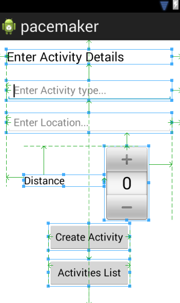
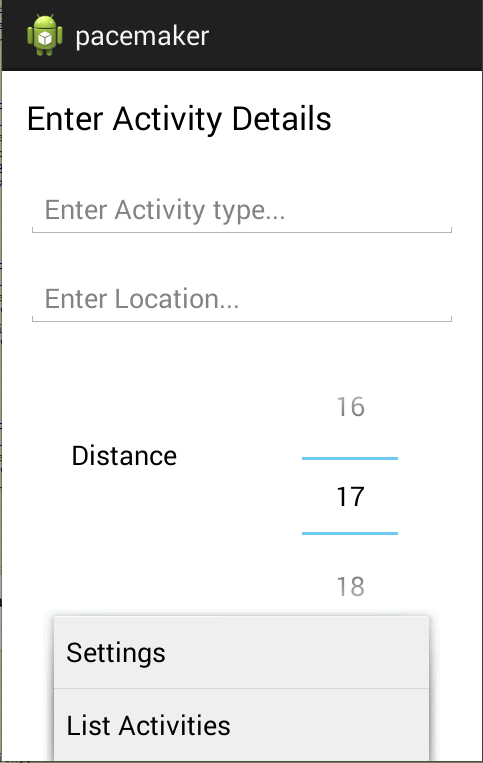

#Exercises

##Exercise 1:

In the last lab, you inserted a new button onto the activities view to allow navigation to the list view:

Remove this button now, and introduce a standard menu item to move between views:

Wire up this menu such that it will trigger the view as expected.

##Exercise 2:

We are still using the stock simple_list_item_1 layout:

- <https://github.com/android/platform_frameworks_base/blob/master/core/res/res/layout/simple_list_item_1.xml>

Experiment with designing a new layout, which is to be loaded instead of the above layout. This one should have three text fields (instead of 1 above) and you can use these to display the type, location and distance attributes of each activity.

HINT:

This would be a reasonable activity_row_layout.xml:

~~~xml
<?xml version="1.0" encoding="utf-8"?>
<RelativeLayout xmlns:android="http://schemas.android.com/apk/res/android"
    android:layout_width="match_parent"
    android:layout_height="match_parent" >

    <TextView
        android:id="@+id/type"
        android:layout_width="wrap_content"
        android:layout_height="wrap_content"
        android:layout_alignParentLeft="true"
        android:layout_alignParentTop="true"
        android:layout_marginLeft="30dp"
        android:layout_marginTop="27dp"
        android:text="" />

    <TextView
        android:id="@+id/distance"
        android:layout_width="wrap_content"
        android:layout_height="wrap_content"
        android:layout_alignBaseline="@+id/type"
        android:layout_alignBottom="@+id/type"
        android:layout_alignParentRight="true"
        android:layout_marginRight="40dp"
        android:text="" />

    <TextView
        android:id="@+id/location"
        android:layout_width="wrap_content"
        android:layout_height="wrap_content"
        android:layout_alignBaseline="@+id/distance"
        android:layout_alignBottom="@+id/distance"
        android:layout_centerHorizontal="true"
        android:text="" />

</RelativeLayout>
~~~

Place this in the `res\layout' folder - and use it instead of 'simple_list_item_1' when initialising the adapter. You will then need to load the controls directly from the adapter. something like this:

~~~
    TextView type      = (TextView) view.findViewById(R.id.type);
    TextView location  = (TextView) view.findViewById(R.id.location);
    TextView distance  = (TextView) view.findViewById(R.id.distance);
    
    type.setText(activity.type);
    location.setText(activity.location);
    distance.setText("" + activity.distance);
~~~

##Solution:

This is version 2 of the pacemaker-android app (including solutions to the above exercises):

- [pacemaker-android-v2.zip](./archives/pacemaker-android-v2.zip)

