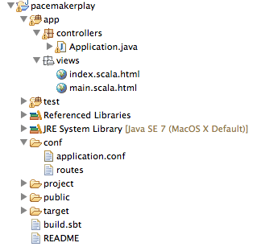

#Install Play

For this lab, the most stable version of eclipse maybe this one:

 - <http://scala-ide.org/download/sdk.html>

Which bundles support for the Play Framework.

Once you have installed it, run 'check for updates' form the Help menu to make sure you have the latest version.

Download and install the latest version of the Play Framework (currently 2.2.1)

- <http://www.playframework.com>

This will involve simply unzipping the archive, and placing the unzipped folder on the path.

NB: Please check your version of play! Play 2.1 (the earlier release) has a slightly different layout - so if you have this version please upgrade.

~~~
play new pacemakerplay
~~~

~~~
       _
 _ __ | | __ _ _  _
| '_ \| |/ _' | || |
|  __/|_|\____|\__ /
|_|            |__/

play 2.2.1 built with Scala 2.10.2 (running Java 1.7.0_40), http://www.playframework.com

The new application will be created in /Users/edeleastar/repos/modules/agile/pacemaker/pacemaker-1.0/pacemakerplay

What is the application name? [pacemakerplay]
>

Which template do you want to use for this new application?

  1             - Create a simple Scala application
  2             - Create a simple Java application

> 2
OK, application pacemakerplay is created.

Have fun!
~~~

- select 'Simple Java application'

Back in the console, change into the new project folder (pacemakerplay) and run the play command:

~~~
cd pacemakerplay
play
~~~

this will respond with something like this:

~~~
...
       _
 _ __ | | __ _ _  _
| '_ \| |/ _' | || |
|  __/|_|\____|\__ /
|_|            |__/

play 2.2.1 built with Scala 2.10.2 (running Java 1.7.0_40), http://www.playframework.com

> Type "help play" or "license" for more information.
> Type "exit" or use Ctrl+D to leave this console.

[pacemakerplay] $
~~~

~~~
eclipse
~~~

~~~
[info] About to create Eclipse project files for your project(s).
[info] Updating {file:/Users/edeleastar/repos/modules/agile/pacemaker/pacemaker-1.0/pacemakerplay/}pacemakerplay...
[info] Resolving org.fusesource.jansi#jansi;1.4 ...
[info] Done updating.
[info] Compiling 4 Scala sources and 2 Java sources to /Users/edeleastar/repos/modules/agile/pacemaker/pacemaker-1.0/pacemakerplay/target/scala-2.10/classes...
[info] Successfully created Eclipse project files for project(s):
[info] pacemakerplay
[pacemakerplay] $
~~~

Import this project into eclipse - it should look something like this:

In the play console, enter 

~~~
run
~~~

which should display:

~~~
--- (Running the application from SBT, auto-reloading is enabled) ---

[info] play - Listening for HTTP on /0:0:0:0:0:0:0:0:9000

(Server started, use Ctrl+D to stop and go back to the console...)
~~~

Browse to :

- <http://localhost:9000>

It should display a standard greeting page.
