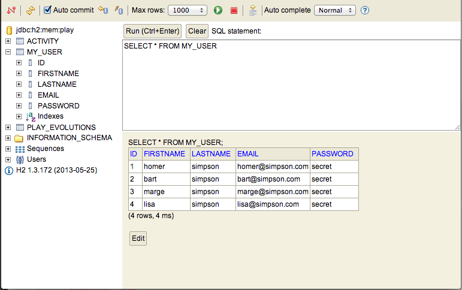

#Initial Data

Edit `conf/application.conf`, locate and uncomment the following lines:

~~~
db.default.driver=org.h2.Driver
db.default.url="jdbc:h2:mem:play"
db.default.user=sa
db.default.password=""

ebean.default="models.*"
~~~

Also, find a suitable place for this new entry:

~~~
applyEvolutions.default=true
~~~

Now create a new file called 'initial-data.yml' in the conf folder. Incorporate the following data:

~~~
# Users
users:

    - !!models.User
        email:      homer@simpson.com
        firstname:  homer
        lastname:   simpson        
        password:   secret
    
    - !!models.User
        email:      bart@simpson.com
        firstname:  bart
        lastname:   simpson        
        password:   secret

    - !!models.User
        email:      marge@simpson.com
        firstname:  marge
        lastname:   simpson        
        password:   secret   
        
    - !!models.User
        email:      lisa@simpson.com
        firstname:  lisa
        lastname:   simpson        
        password:   secret                     
~~~

In the app folder (not in any package), introduce this class:

~~~java
import play.*;
import play.libs.*;
import java.util.*;
import com.avaje.ebean.*;

import models.*;
@SuppressWarnings("unchecked")
public class Global extends GlobalSettings
{
  public void onStart(Application app)
  {
    InitialData.insert(app);
  }

  static class InitialData
  {
    public static void insert(Application app)
    {
      if (Ebean.find(User.class).findRowCount() == 0)
      {
        Map<String, List<User>> all = (Map<String, List<User>>) Yaml.load("initial-data.yml");
        Ebean.save(all.get("users"));
      }
    }
  }
}
~~~

If the app is running, stop it (Ctrl-D). Enter the following command on the play console:

~~~
h2-browser
~~~

This will launch a simple database viewer. Now run the app in the usual way:

~~~
run
~~~

Browse to :

- <http://localhost:9000>

Verify that, once the app is launched, the user table is populated with the above values. the h2-browser should look something like this:

