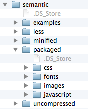
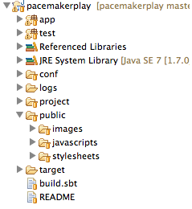
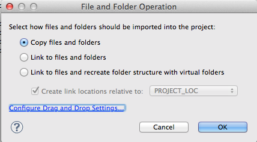
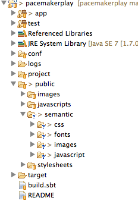
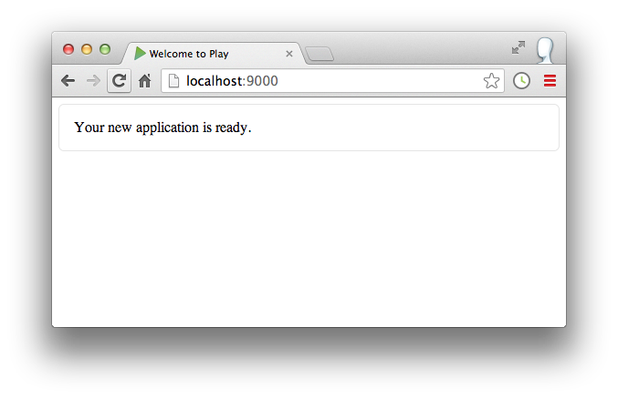

#Semantic UI	

Visit Semantic UI :

- <http://semantic-ui.com/>

and download the zip archive prominent on the home page. Expand the archive, which should look like this:

Open the pacemakerplay project in eclipse, and expand the 'public' folder:

Now drag and drop the 'packaged' folder from the semantic ui download, and drop it into the public folder. On the way you will get this dialog:

Make sure to select 'copy' as shown. Once it is copied over, rename the 'packaged' folder to 'semantic'

We can now include the semantic css into our ui by changing `views/main.scala.html` as follows:

~~~html
@(title: String)(content: Html)

<!DOCTYPE html>

<html>
    <head>
        <title>@title</title>
        <link rel="stylesheet" media="screen" href="@routes.Assets.at("semantic/css/semantic.css")">
        <link rel="stylesheet" media="screen" href="@routes.Assets.at("stylesheets/main.css")">
        <link rel="shortcut icon" type="image/png" href="@routes.Assets.at("images/favicon.png")">
        
         
    </head>
    <body>
      @content
    </body>
</html>
~~~

We have just entered two extra lines above - a new stylesheet included before the existing one and a javascript after the jquery include.

To test this, we will change the index file `views/index.scala` as follows:

~~~xml
@(message: String)

@main("Welcome to Pacemaker") {

  

    
 @message 

  

  
}
~~~

This should display the greeting in a simple segment:

Introduction to segments here:

- <http://semantic-ui.com/elements/segment.html>

The above page is rendered in response to `/` request as mapped in the routes file:

~~~
GET     /                                          controllers.Application.index()
~~~

... this is the controller itself:

~~~java
public class Application extends Controller
{
  public static Result index()
  {
    return ok(index.render("Your new application is ready."));
  }
}
~~~

See if you can follow the logic of the page creation - particularly the relationship between:

- Application.java
- index.scala.html
- main.scala.html
