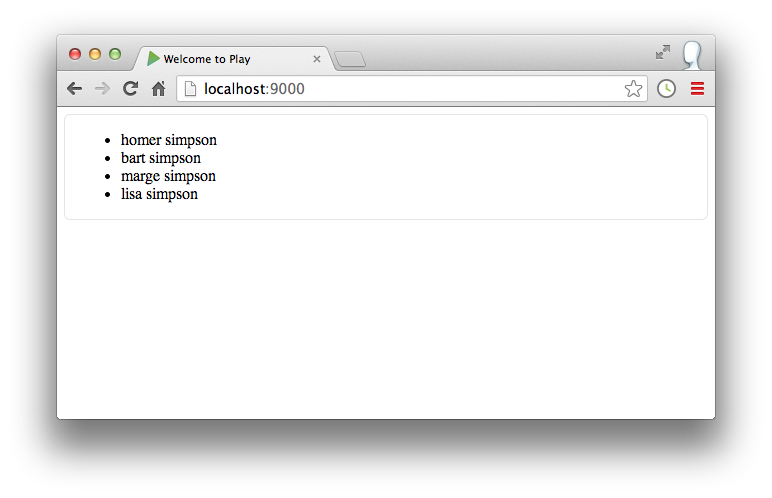
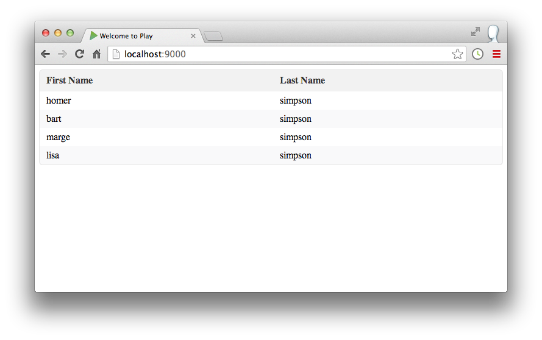

#Displaying the Users List

The templating language - used to generate the actual html pages - is a very simple subset of Scala.

- <http://www.playframework.com/documentation/2.2.1/ScalaTemplates>

The above guide - just a single page of documentation - is probably all you need to know.

Here is a revised version of index.scala.html to generate a list of users as a `<ul>`:

~~~xml
@(users: List[User])

@main("Welcome to Play") {

  

  <ul>
    @for(i <- 0 until users.size) {
      <li> 
        @users(i).firstname @users(i).lastname </a> 
      </li>
    }
  </ul>
  

}
~~~

Run the app now, and we should see the list:

or we can display this as an elegant table using semantic ui:

- <http://semantic-ui.com/collections/table.html>

Here is a revised layout using a table:

~~~xml
@(users: List[User])

@main("Welcome to Play") {

	<table class="ui table segment">
	  <thead>
	    <tr>
	      <th>First Name</th>
	      <th>Last Name</th>
	    </tr>
	  </thead>
	  <tbody>
	    @for(i <- 0 until users.size) {
	      <tr>
	        <td> @users(i).firstname</td> <td> @users(i).lastname </td> 
	      </tr>
	    }
	  </tbody>
	</table>
}
~~~

