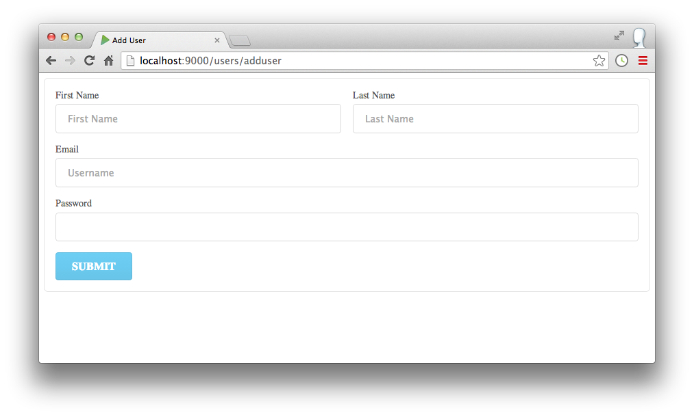

#Form Design

Forms can be assembled cleanly in Semantic UI:

- <http://semantic-ui.com/collections/form.html>

Here is a replacement for adduser.scala.html:

~~~xml
@()

@main("Add User") {

  

    

      

        <label>First Name</label>
        <input placeholder="First Name" type="text" name="firstname">
      

      

        <label>Last Name</label>
        <input placeholder="Last Name" type="text" name="lastname">
      

    

    

      <label>Email</label>
      <input placeholder="email" type="text" name="email">
    

    

      <label>Password</label>
      <input type="password" name="password">
    

    <input type="submit" class="ui blue submit button" value="Submit">
  

}
~~~

In order to send this to our application, we would need to encapsulate it on a standard `<form>` element, and define associated action and method attributes:

~~~xml
  <form action="/users/submituser" method="POST">
    ...
  </form> 
~~~

Place the above around our outer div.

For this to work, we will need a route:

~~~
POST    /users/submituser                          controllers.Application.submitUser()
~~~

and a corresponding action:

~~~java
  public static Result submitUser()
  {
    return redirect ("/");
  }
~~~

This should work - and pressing the submit button should take us back to the users list page.

