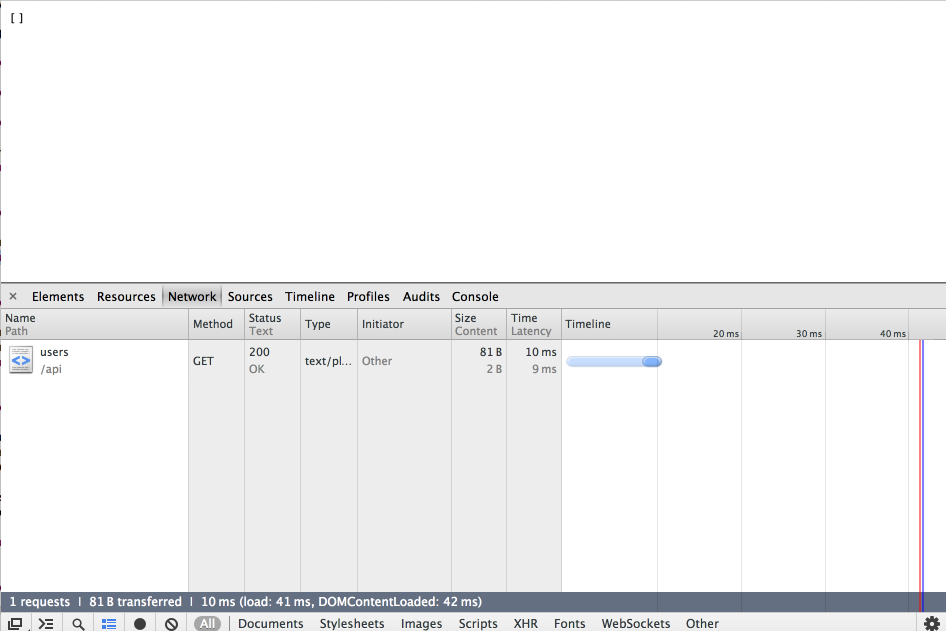
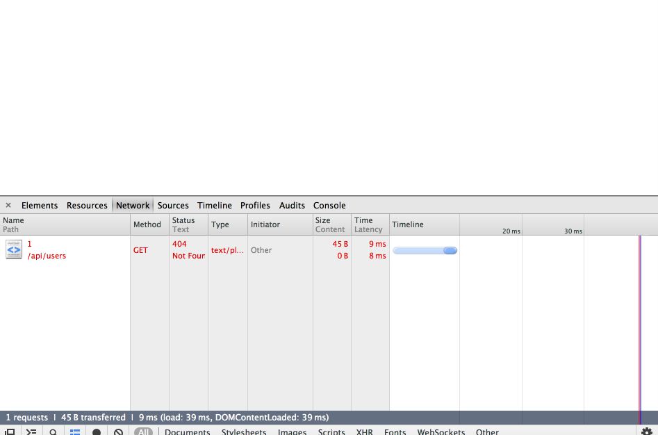
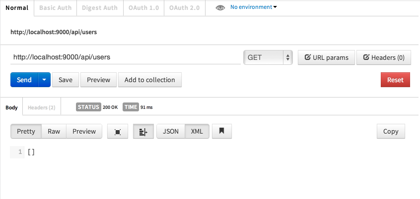
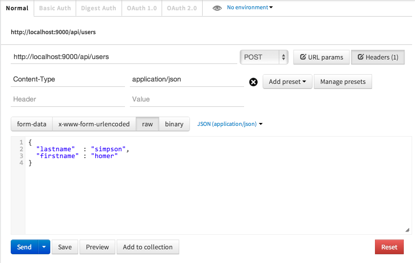

#Testing pacemakerplay API

#Testing

Make sure the app is running, and browse to :

- <http://localhost:9000/api/users>

Viewing the page source, you should see:

~~~
[]
~~~

Also, if using chrome, keep an eye on the actual http traffic (via Tools menu ->Developers Tools):

Try browsing to this url:

- <http://localhost:9000/api/users/1>

The browser will be blank, however, the developer tools should display the actual response:

This reveals a '404' not found error.

More comprehensive tools for testing http interfaces are available. Search for the Chrome 'Postman REST Client' - and install as a chrome app on your workstation. Using Postman, experiment with the two links we tested above:

Now try to replicate the request as shown below (note the `Headers' Content-Type set to 'application/json':

When you press 'Send' you may see this response:

No try this request again:

- <http://localhost:9000/api/users/1>

In the above interchange, we have use the REST interface to create a User, and then subsequently get the user (by the id 1).

Create a few more users and verify that you can get them. See if you can also do the following:

- Delete (via a DELETE) request
- Update (via a PUT) request.

Also, examine the database via the h2-console, and see if you can verify if the 'my_users' table is being updated.
