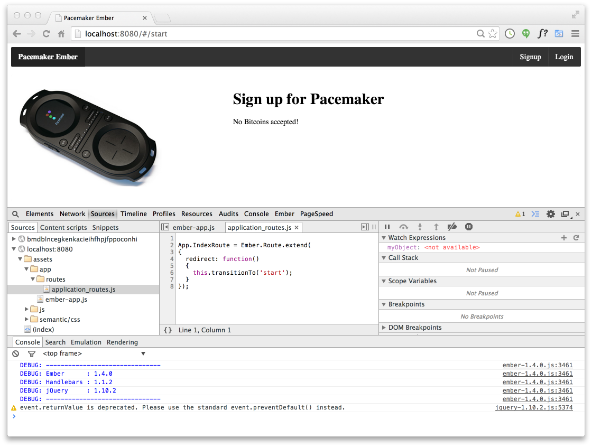

#app.js

Still in `public`, create a new folder called `app`, containing the following script:

##app.js

~~~javascript
var apiUrl = '/api'  
  
App = Ember.Application.create(
{
  currentUser: localStorage['currentUser']  
});

App.Router.map(function()
{
  this.resource('start');
  this.resource('signup');
  this.resource('login'); 
  this.resource('dashboard');
});
~~~

In `public/app` create a folder called `routes` and introduce this script:

##application_routes.js

~~~javascript
App.IndexRoute = Ember.Route.extend(
{
  redirect: function() 
  {
    this.transitionTo('start');
  }
});
~~~

Also in `public/app`, create a folder called `controllers` containing the following:

##application_controller.js

~~~javascript
App.ApplicationController = Ember.Controller.extend(
{ 
  signedInUser: function() 
  {
    return this.store.find('user', localStorage['currentUser']);
  }.property('App.currentUser'),

  userSignedIn: function() 
  {
    return localStorage['currentUser'] != null;
  }.property('App.currentUser'),

  actions: 
  {
    signout: function() 
    {
      delete localStorage['currentUser'];
      App.set('currentUser', undefined);
      this.transitionToRoute("start");
    }
  }
});
~~~

We can now bring the application up. Back in `pacemaker.html`, introduce these two templates just inside the opening `<body>` tag:

~~~
    

    
~~~

Finally, just before the closing `</body>` tag, include the two scripts defined above:

~~~html
    
    
        
~~~

`pacemaker-node/public` should be structured as follows:

~~~
── app
│   ├── app.js
│   ├── controllers
│   │   └── application_controller.js
│   └── routes
│       └── application_routes.js
├── images
│   ├── favicon.png
│   └── pacemaker.jpg
├── js
│   ├── ember-1.4.0.js
│   ├── handlebars-1.1.2.js
│   ├── jquery-1.10.2.js
│   └── underscore-min.js
├── pacemaker.html
└── semantic
      ...
~~~

Browsing to :

- <http://localhost:8080>

should bring up the application:

Note that we can set breakpoints, and even debug, the application.

