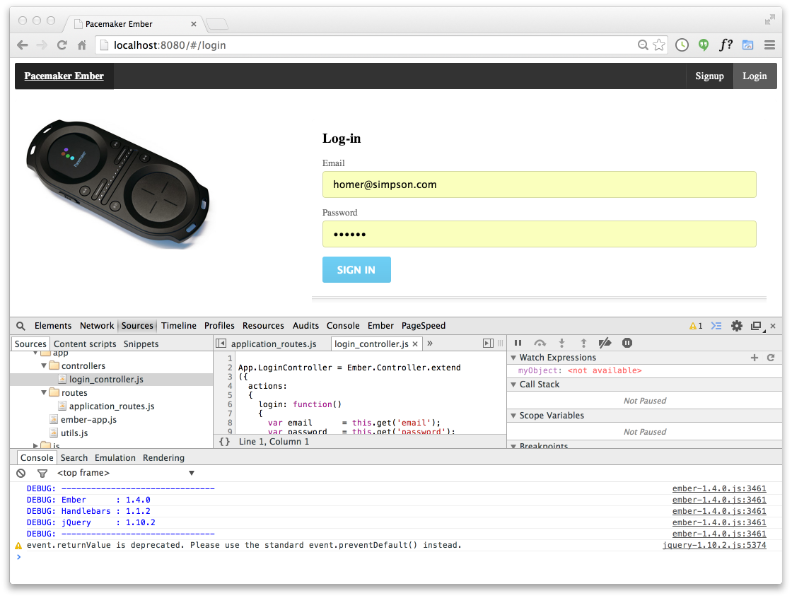
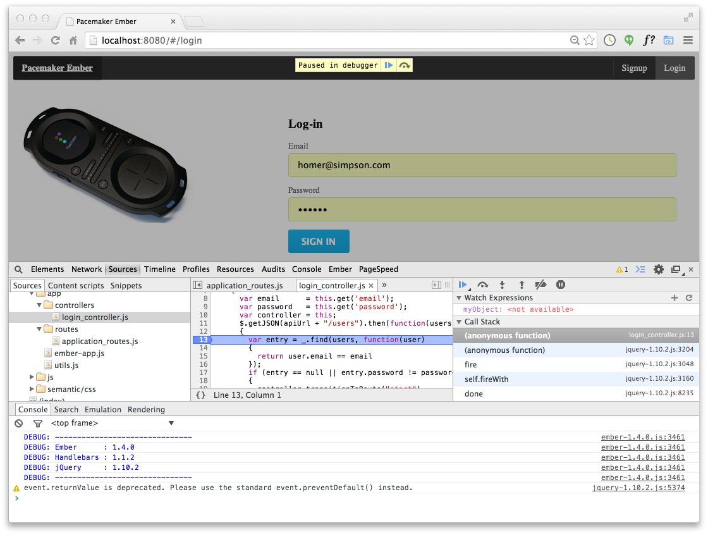

#Login

Introduce a `login` template into `pacemaker.html`:

~~~
    
~~~

For this template, we need a controller, located in `public/app/controllers`:

##login_controller.js

~~~javascript
App.LoginController = Ember.Controller.extend
({  
  actions: 
  {
    login: function() 
    {
      var email      = this.get('email');
      var password   = this.get('password');
      var controller = this;
      $.getJSON(apiUrl + "/users").then(function(users)
      {
        var entry = _.find(users, function(user)
        {
          return user.email == email 
        });
        if (entry == null || entry.password != password)
        {
          controller.transitionToRoute("start")
        }
        else
        {
          localStorage['currentUser'] = entry.id;
          App.set('currentUser', entry.id);
          controller.transitionToRoute("dashboard")
        }
      });
    }
  }
});
~~~

This script makes use of a helper functions we can define in another script in `public/app`:

##utils.js

~~~javascript

function apiDelete(api)
{
  $.ajax(
  {
    url: api,
    contentType: 'application/json',
    type: 'DELETE',
    data: "{}",
    processData: false,
    dataType: 'json'
  })
}

function apiPost(api, object, doneCallback )
{
  $.ajax(
  {
    url: api,
    type: 'POST',
    contentType: 'application/json',
    data: JSON.stringify(object),
    processData: false,
    dataType: 'json'
  }).done (function (data)
  {
    doneCallback(data);
  });
}
~~~

Engaging this view now merely including the extra scrips at the end of `pacemaker.html`:

~~~
    
    
~~~

This should enable to 'login' menu option, displaying the login view:

It will be possible to set a breakpoint in the ajax request:

and inspect the returned user objects:

