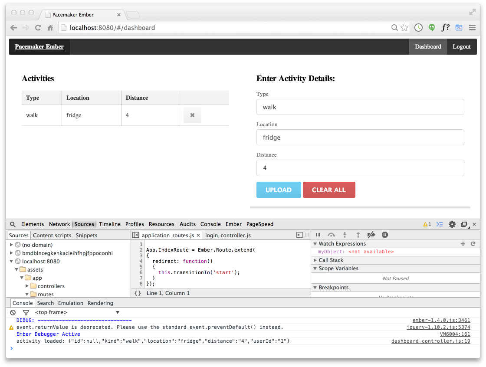

#Dashboard

The dashboard, consisting of a list of activities + a simple form to upload them, can be composed using 1 template + 2 partials:

~~~
    
    
    

    
~~~

Place these in `pacemaker.html`

This will require a matching route in `/pacemaker-node/public/app/routes`:

##dashboard_routes.js

~~~javascript
App.DashboardRoute = Ember.Route.extend
({
  model: function(params) 
  { 
    userid = localStorage['currentUser'] 
    return $.getJSON(apiUrl + "/users/" + userid).then(function(userDetails)
    {
     return userDetails
    });
  }
});
~~~

... and a controller in `/pacemaker-node/public/app/controllers`:

##dashboard_controller.js

~~~javascript
App.DashboardController = Ember.ObjectController.extend
({    
  actions: 
  {
    upload: function(params) 
    {
      var controller = this;
      var model = this.get("model");
      var activity = {};
      activity.kind     = model.kind;
      activity.location = model.location;
      activity.distance = model.distance;
      
      userid = localStorage['currentUser'] 
      
      apiPost(apiUrl + "/users/" + userid + "/activities", activity, function done(data)
      {
        console.log ( "activity loaded: " + JSON.stringify(data) );
        model.activities.pushObject(data);
      });
    },

    clearall: function(params)  
    {  
      apiDelete(apiUrl + "/users/" + params.id + "/activities")    
      var model = this.get("model");
      model.activities.clear();
    },
    
    remove: function(params)  
    { 
      var model = this.get("model");
      apiDelete(apiUrl + "/users/" + model.id + "/activities/" + params.id)      
      var entry = _.find(model.activities, function(obj) { return obj.id == params.id })
      model.activities.removeObject(entry);
    }   
    
  }
});
~~~

These will need to be included in `pacemaker.html`:

~~~html
    
     
~~~

Logging in should now display the dashboard:

You should be able to upload and delete activities.

