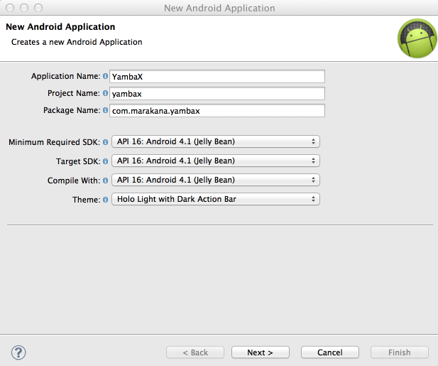
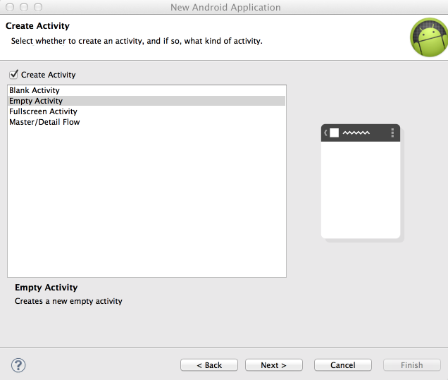
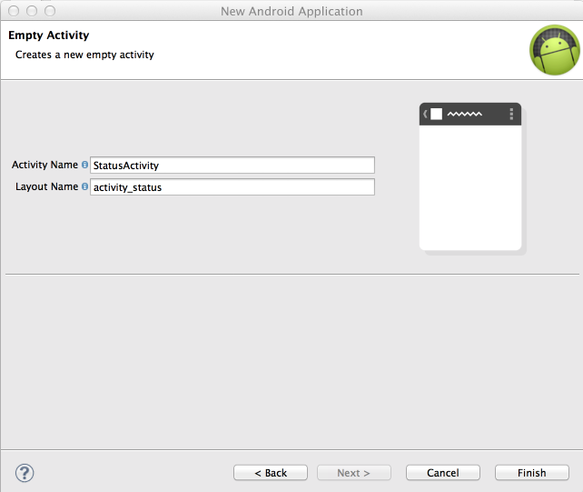
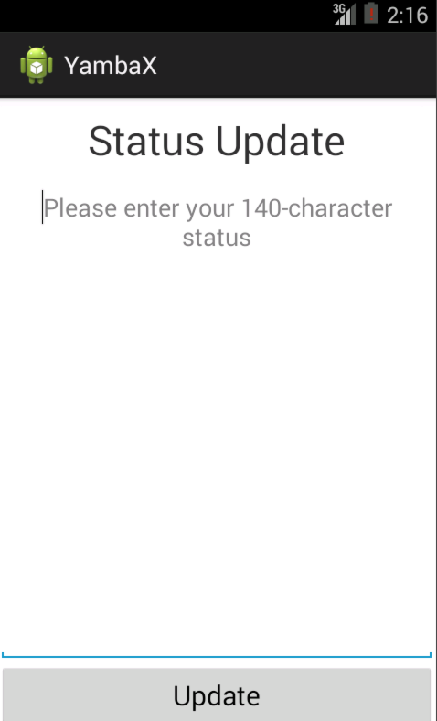

#Starter Application

Create a standard Android Application called 'yambax', with the following characteristics:

Make sure you can launch this application in the emulator

Bring in these string reources:

##res/values/strings.xml

~~~
<resources>
  <string name="app_name">Yamba X</string>
  <string name="titleYamba">YambaX</string>
  <string name="titleStatus">Status Update</string>
  <string name="hintText">Please enter your 140-character status</string>
  <string name="buttonUpdate">Update</string>
</resources>
~~~

... and this layout:

##res/layout/activity_status.xml

~~~
<LinearLayout xmlns:android="http://schemas.android.com/apk/res/android"
  android:orientation="vertical" android:layout_width="fill_parent"
  android:layout_height="fill_parent">
  
  <!-- Title TextView-->
  <TextView android:layout_width="fill_parent"
    android:layout_height="wrap_content" android:gravity="center"
    android:textSize="30sp"
    android:layout_margin="10dp" android:text="@string/titleStatus"/>
    
  <!-- Status EditText  -->
  <EditText android:layout_width="fill_parent"
    android:layout_height="0dp" android:layout_weight="1"
    android:hint="@string/hintText" android:id="@+id/editText"
    android:gravity="top|center_horizontal"></EditText>
    
  <!-- Update Button -->
  <Button android:layout_width="fill_parent"
    android:layout_height="wrap_content" android:text="@string/buttonUpdate"
    android:textSize="20sp" android:id="@+id/buttonUpdate"></Button>
    
</LinearLayout>
~~~

Download this jar archive :

- [jtwitter-yamba.jar](archives/jtwitter-yamba.jar)

and copy to the  `lib` folder of your android project.

This is a lightweight java-twitter library, based on this project here:

- <https://github.com/winterstein/JTwitter>

Replace your StatusActivity with the following:

##StatusActivity:

~~~java
package com.marakana.yambax;

import winterwell.jtwitter.Twitter;
import android.app.Activity;
import android.os.Bundle;
import android.util.Log;
import android.view.View;
import android.view.View.OnClickListener;
import android.widget.Button;
import android.widget.EditText;

public class StatusActivity extends Activity implements OnClickListener
{ 
  private static final String TAG = "StatusActivity";
  EditText editText;
  Button updateButton;
  Twitter twitter;

  @Override
  public void onCreate(Bundle savedInstanceState)
  {
    super.onCreate(savedInstanceState);
    setContentView(R.layout.activity_status);

    editText = (EditText) findViewById(R.id.editText);
    updateButton = (Button) findViewById(R.id.buttonUpdate);

    updateButton.setOnClickListener(this); 

    twitter = new Twitter("student", "password"); 
    twitter.setAPIRootUrl("http://yamba.marakana.com/api");
  }

  public void onClick(View v)
  {
    twitter.setStatus(editText.getText().toString()); 
    Log.d(TAG, "onClicked");
  }
}
~~~

Launch and you should see:

If you attempt a status update, your application may close. This is caused by an attempt to perform network access on the main thread (inside the twitter.setStatus method). For test purposes, we can disable this:

~~~java
    StrictMode.ThreadPolicy policy = new StrictMode.ThreadPolicy.Builder().permitAll().build();
    StrictMode.setThreadPolicy(policy); 
~~~

Run the app again and attempt to update status again. The status should appear here:

- <http://yamba.marakana.com>

---
####[source](https://github.com/edeleastar/yambax/commit/2598f03c03cc3102d743d7a68ab9c987a23dc5c7)
---

