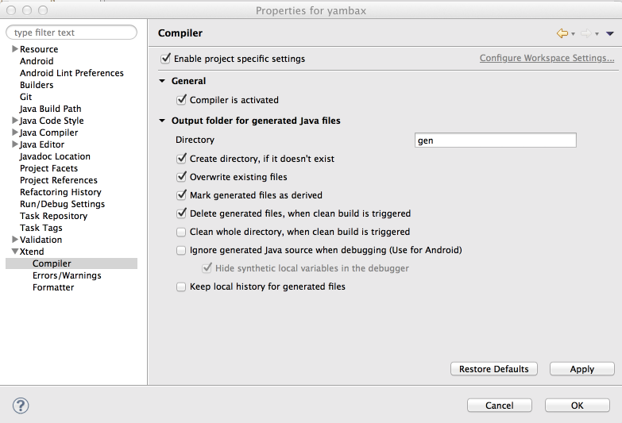
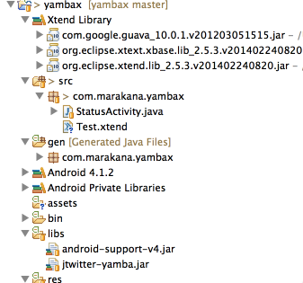
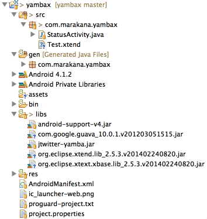

#Xtext Nature

Add xtext nature to the project by selecting Project Properties->Configure->Add Xtext Nature

Then in settings change the generated java folder to align with ADKs expectations (gen):

To prime the project with the correct libraries, create a new XTend class call `Test` in the `com.marakana.yambax` package:

~~~
package com.marakana.yambax

class Test {
	
}
~~~

This will have an error on the package declaration. Select the error and it will prompt with "Add Xtext Lbraries to the project". Select this, and the libraries will be added. Your project will look like this:

Look carefully at the three jar files added under 'Xtend Library'. You will need to locate these files using explorer/finder, and copy them to the `lib` folder of your project.

Delete the "Xtext Library" artifact from the project by selecting it and then selecting 'remove from build path'.

The project should resemble the following:

Finally, delete the current classes in com.marakana.com and replace them with the following:

##StatusActivity.xtend

~~~java
package com.marakana.yambax

import android.app.Activity
import android.os.Bundle
import android.widget.EditText
import android.widget.Button
import android.view.View.OnClickListener
import android.view.View
import winterwell.jtwitter.Twitter
import android.util.Log
import android.os.StrictMode

class StatusActivity extends Activity implements OnClickListener
{
  val TAG = "StatusActivity"
  var EditText editText
  var Button updateButton
  var twitter = new Twitter("student", "password")

  override onCreate(Bundle savedInstanceState)
  {
    super.onCreate(savedInstanceState)
    setContentView(R.layout.activity_status)
    
    val policy = new StrictMode.ThreadPolicy.Builder().permitAll().build();
    StrictMode.setThreadPolicy(policy);
    
    editText     = findViewById(R.id.editText) as EditText
    updateButton =  findViewById(R.id.buttonUpdate) as Button
    
    updateButton.setOnClickListener(this)

    twitter.setAPIRootUrl("http://yamba.marakana.com/api")
  }

  override onClick(View arg0)
  {
  	twitter.setStatus(editText.getText.toString)
    Log.d(TAG, "onClicked")
  }
}
~~~

Make sure the application has Internet Permissions enabled in the manifest:

##AndridManifest.xml

~~~
    <uses-permission android:name="android.permission.INTERNET" /> 
~~~

You should be able to launch this application on the emulator, enter some text and press 'Update'. Expect to see your text on this site:

- <http://yamba.marakana.com>

---
####[Source](https://github.com/edeleastar/yambax/commit/7bc6b7b67d0dbe3930bee74bc27b87231335d7d0)
---

