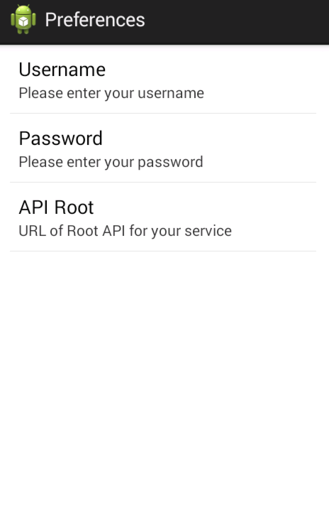

#Preferences

Introduce the following new strings into `res/values/strings.xml`:

~~~
  <string name="titlePrefs">Preferences</string>
  <string name="titleUsername">Username</string>
  <string name="titlePassword">Password</string>
  <string name="titleApiRoot">API Root</string>
  
  <string name="summaryUsername">Please enter your username</string>
  <string name="summaryPassword">Please enter your password</string>
  <string name="summaryApiRoot">URL of Root API for your service</string>
~~~

This will allow us to define a `res/menus/menu.xml` resource:

~~~
<menu xmlns:android="http://schemas.android.com/apk/res/android" >
    <item android:id="@+id/itemPrefs" android:title="@string/titlePrefs"
         android:icon="@android:drawable/ic_menu_preferences"></item>
</menu>
~~~

Now we can create a PreferencesActivity. Introduce a new folder in `res` called `xml`, and create this file in there:

##prefs.xml

~~~
<PreferenceScreen xmlns:android="http://schemas.android.com/apk/res/android" >
  <EditTextPreference android:title="@string/titleUsername"
    android:summary="@string/summaryUsername" android:key="username"></EditTextPreference>

  <EditTextPreference android:title="@string/titlePassword"
    android:password="true" android:summary="@string/summaryPassword"
    android:key="password"></EditTextPreference>

  <EditTextPreference android:title="@string/titleApiRoot"
    android:summary="@string/summaryApiRoot" android:key="apiRoot"></EditTextPreference>
</PreferenceScreen>
~~~

Create a new `PrefsActivity` activity class in `com.marakana.yambax`:

##PrefsActivity.xtend:

~~~java
package com.marakana.yambax

import android.os.Bundle
import android.preference.PreferenceActivity;

class PrefsActivity extends PreferenceActivity 
{
  override onCreate(Bundle savedInstanceState)
  {
    super.onCreate(savedInstanceState);
    addPreferencesFromResource(R.xml.prefs); 
  }  
}
~~~

We can display a menu and the PrefsActivity in the StatusUdate activity:

~~~java
  override  onCreateOptionsMenu(Menu menu)
  {
    getMenuInflater.inflate(R.menu.menu, menu)
    true
  }
  
  override onOptionsItemSelected(MenuItem item)
  {
  	startActivity(new Intent(this, typeof(PrefsActivity)))
    true
  }
~~~

Finally, make sure the activity is referenced in the manifest:

~~~
    <activity android:name=".PrefsActivity" android:label="@string/titlePrefs" />
~~~

When the menu is selected, we should see something like this:

---
####[Source](https://github.com/edeleastar/yambax/commit/6cc742a4372e63c61d34ac47f6e8d75df099e39c)
---

