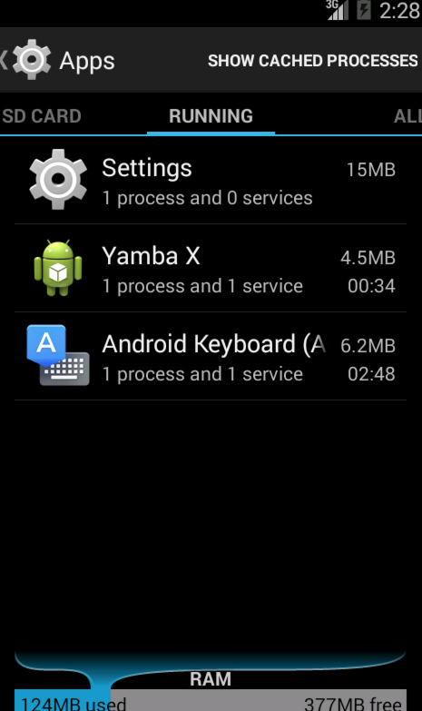

#BroadcastReciever - Boot

Introduce this class to receive bootloader events:

##YambaApplication.xtend

~~~java
class BootReceiver extends BroadcastReceiver
{
  override onReceive(Context context, Intent intent) 
  {
    context.startService(new Intent(context, typeof(UpdaterService)))
  }
} 
~~~

This will start the updater service when the device boots. It requires this permission in the manifest:

##AndroidManifest

~~~
    <uses-permission android:name="android.permission.RECEIVE_BOOT_COMPLETED" />
~~~

~~~
      <receiver android:name="com.marakana.yambax.BootReceiver">
        <intent-filter>
          <action android:name="android.intent.action.BOOT_COMPLETED" />
        </intent-filter> 
      </receiver>  
~~~

We can change our default service state to running:

##YambaApplication.xtend

~~~java
  @Property boolean                serviceRunning = true
~~~

.. and also make some adjustments to the toggle service action:

##BaseActivity.xtend

~~~java
  val toggleService = [ | intent = new Intent(this, typeof(UpdaterService))
                          if (app.isServiceRunning)
                            stopService(intent)
                           else
                            startService(intent) 
                          app.serviceRunning = !app.serviceRunning] as Command
~~~

You can inspect the list of running services on the device:

---
####[Source](https://github.com/edeleastar/yambax/commit/18e01fd9497959213352b2a9c91a77a78ccc2c3f)
---