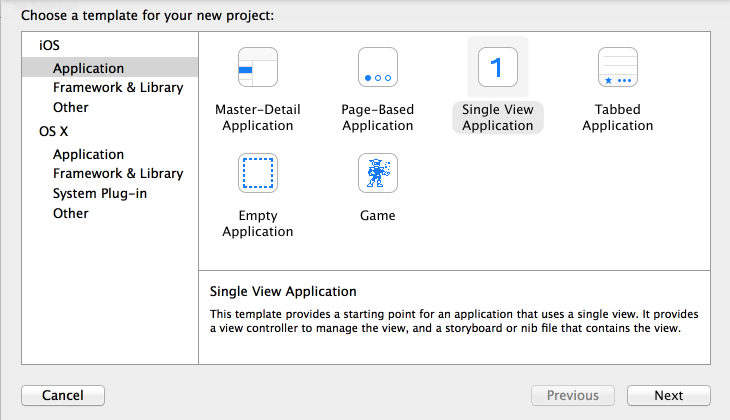
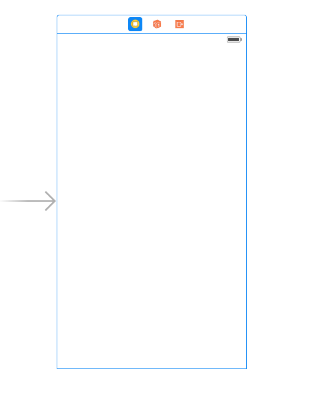

#Setup

In XCode, create a new IOS 'Single View' Swift application:

Make sure the app is a Swift application:

Use this .gitignore file:

~~~
# Xcode
#
build/
*.pbxuser
!default.pbxuser
*.mode1v3
!default.mode1v3
*.mode2v3
!default.mode2v3
*.perspectivev3
!default.perspectivev3
xcuserdata
*.xccheckout
*.moved-aside
DerivedData
*.hmap
*.ipa
*.xcuserstate
~~~

(just copy/paste this into .gitignore in your projects folder)

Commit this to git using your preferred method.

Run the app now using the simulator:

You should have these sources:

##AppDelegate

~~~
import UIKit

@UIApplicationMain
class AppDelegate: UIResponder, UIApplicationDelegate
{
  var window: UIWindow?

  func application(application: UIApplication, didFinishLaunchingWithOptions launchOptions: NSDictionary?) -> Bool
  {
    return true
  }

  func applicationWillResignActive(application: UIApplication)
  {
  }

  func applicationDidEnterBackground(application: UIApplication)
  {
  }

  func applicationWillEnterForeground(application: UIApplication)
  {
  }

  func applicationDidBecomeActive(application: UIApplication)
  {
  }

  func applicationWillTerminate(application: UIApplication)
  {
  }
}
~~~

##ViewController:

~~~
import UIKit

class ViewController: UIViewController
{
  override func viewDidLoad()
  {
    super.viewDidLoad()
  }

  override func didReceiveMemoryWarning()
  {
    super.didReceiveMemoryWarning()
  }
}
~~~

Select the View Controller in the File Inspector:

and disable the use of Auto Layout and size classes. The storyboard scene will be reconfigured to look like this:

