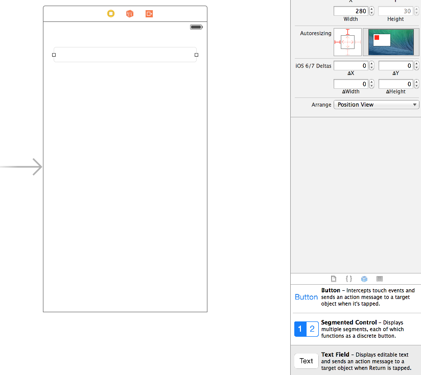
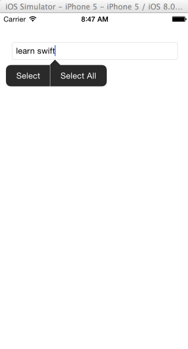
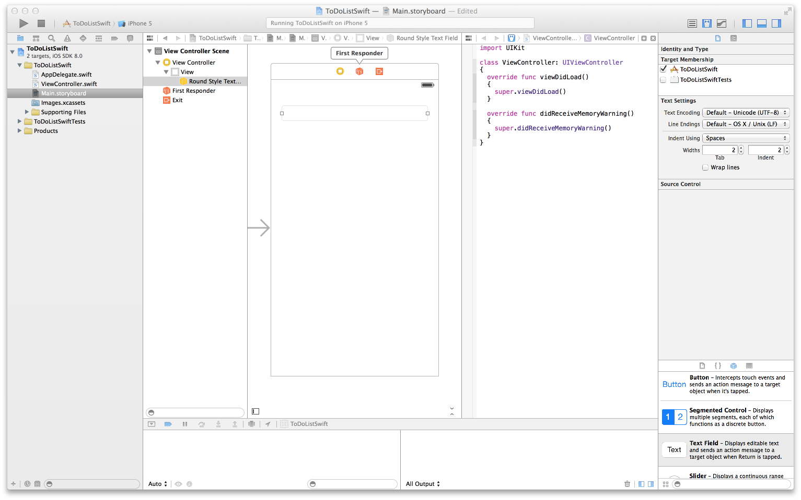
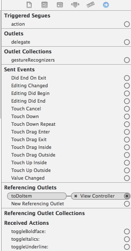
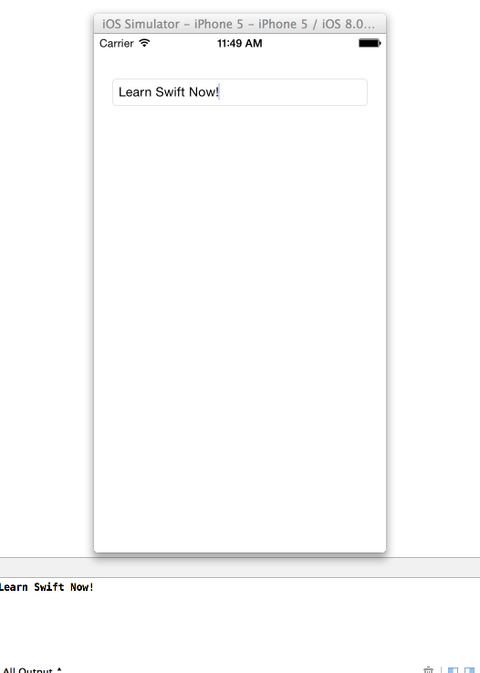

#Outlets & Delegates

Drag a TextField onto the ViewController scene:

Positioning it as shown.

You should now be be able to run the app and enter text:

In the storyboard view, select the View and then View Controller and then select "View->Editors->Show Assistant Editor" from the main menu. This will show the visual and textual representations side-by-side:

Select the EditText control in the view and Ctrl-Drag it to the class. A line appears and try to drop it just inside the opening brace of the class:

In the pop up dialog, enter the name 'toDoItem' as shown and press connect. T The class will look like this:

~~~
import UIKit

class ViewController: UIViewController
{
  @IBOutlet var toDoItem: UITextField
  
  override func viewDidLoad()
  {
    super.viewDidLoad()
  }
  
  override func didReceiveMemoryWarning()
  {
    super.didReceiveMemoryWarning()
  }
}
~~~

A new attribute has been inserted. See if you can locate a reference to this outlet in the 'Connections Inspector'

We would like to know when the user presses return while entering text. One way of doing this is to implement the this protocol:

- [UITextFieldDelegate](https://developer.apple.com/library/prerelease/iOS/documentation/UIKit/Reference/UITextFieldDelegate_Protocol/index.html#//apple_ref/occ/intf/UITextFieldDelegate) 

Implementing a protocol involves appending the protocol name to the class:

~~~
class ViewController: UIViewController, UITextFieldDelegate
~~~

.. and then setting the delegate as soon as the object loads:

~~~
  override func viewDidLoad()
  {
    super.viewDidLoad()
    toDoItem.delegate = self
  }
~~~

Finally, we need to implement a handler for the event we are interested in:

~~~
  func textFieldShouldReturn(textField: UITextField!) -> Bool
  {
    println(toDoItem.text)
    return true
  }
~~~

We should be able to run the app now and the text we have typed should appear on the xcode output window:

This is the complete class:

~~~
import UIKit

class ViewController: UIViewController, UITextFieldDelegate
{
  @IBOutlet var toDoItem: UITextField
  
  override func viewDidLoad()
  {
    super.viewDidLoad()
    toDoItem.delegate = self
  }
  
  func textFieldShouldReturn(textField: UITextField!) -> Bool
  {
    println(toDoItem.text)
    return true
  }
  
  override func didReceiveMemoryWarning()
  {
    super.didReceiveMemoryWarning()
  }
}
~~~