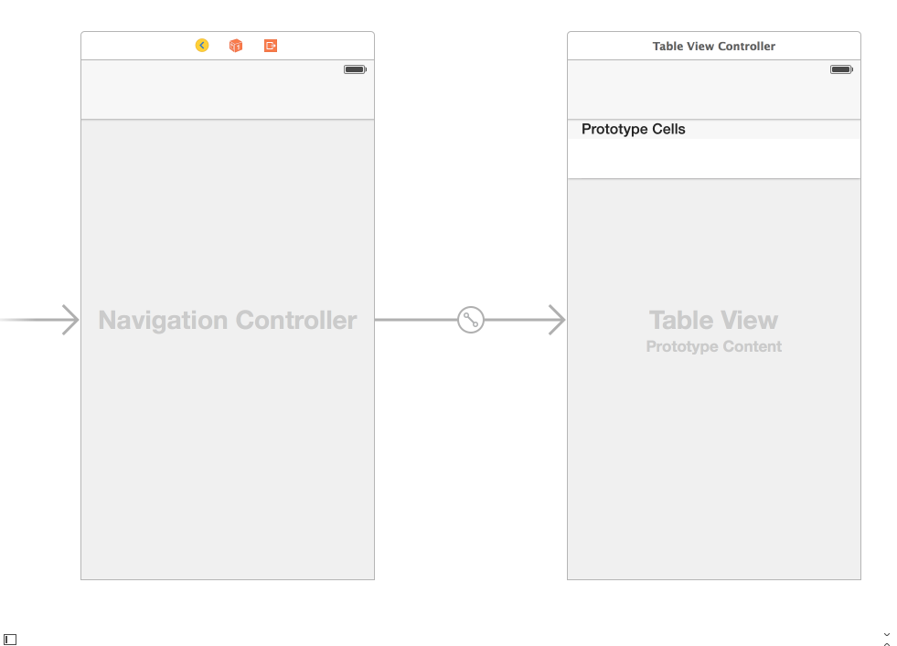
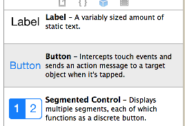
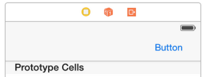
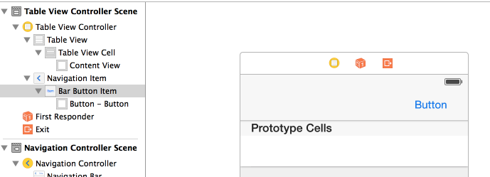
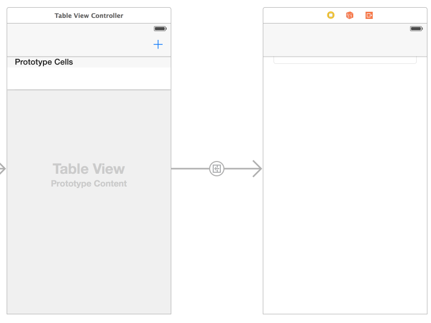
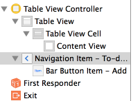
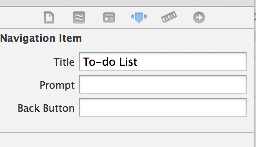

#Connecting Views

Select the Table View Controller in the storyboard editor, and select 'Editor->Embed in->Navigation Controller. This will reconfigure the layout as follows:

It has created space at the top of the TableView, into which we can now drag and drop a button:

Into the navigation area:

When this is placed, select the 'Bar Button' as it is called in the outline view:

Change its identifier to 'Add' in the attributes inspector:

Now Control-Drag the new button to the ViewControler - establishing a new 'segue' in the scene:

When connecting the controller, select 'Push' as the transition type.

You should now be able to run the app and move from the initial table view to the second view using the '+' button. You should also be able to return to this opening view via an automatically generated 'Back' button

In the storyboard outline view, select 'Navigation Item': 

.. and in the Attributes Inspector, enter a title for the Table Controller:

Now try running the app again. Note the changed title in the Item view - from 'Back" to 'To Do List'

