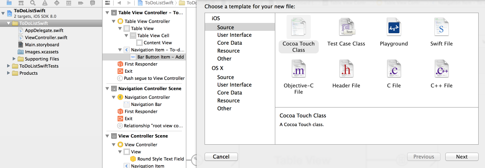
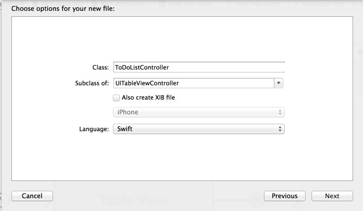
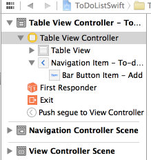
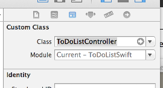

#Custom Classes

The TableViewController we introduced in the storyboard is currently entirely visual, and without any Swift class associated with it. We can create a class now and establish the connection with the visual representation.

Select the folder containing our classes in the project view, right click and select 'New File' then select 'Cocoa Touch' class:

Make sure the class is derived from 'UITableViewController', and call it ToDoListController:

This will generate the following class:

~~~
import UIKit

class ToDoListController: UITableViewController
{
  init(style: UITableViewStyle)
  {
    super.init(style: style)
  }

  override func viewDidLoad()
  {
    super.viewDidLoad()
   }

  override func didReceiveMemoryWarning()
  {
    super.didReceiveMemoryWarning()
  }

  // #pragma mark - Table view data source

  override func numberOfSectionsInTableView(tableView: UITableView?) -> Int
  {
    return 0
  }

  override func tableView(tableView: UITableView?, numberOfRowsInSection section: Int) -> Int
  {
    return 0
  }
}
~~~

(Comments removed)

We now need to connect this class with the visual version as designed in the storyboard.

Select the TableView controller in the outline view:

In the Identity Inspector, select the ToDoListContorller class form the 'Class' drop down:

The class is now bound. To verify this, we can place a simple print statement:

~~~
  override func viewDidLoad()
  {
    super.viewDidLoad()
    println ("Tableview Loaded")
   }
~~~

Run the app now, we get an error message as it is launched:

~~~
/Users/edeleastar/repos/projects/ios/ToDoListSwift/ToDoListSwift/ToDoListController.swift: 3: 3: fatal error: use of unimplemented initializer 'init(coder:)' for class 'ToDoListSwift.ToDoListController'
(lldb) 
~~~

This may be a bug in the xcode beta - include this method in the ToDoListController:

~~~
 init(coder aDecoder: NSCoder!)
  {
    super.init(coder: aDecoder)
  }
~~~

Finally, run it again and look to the the message appearing in xcode:

