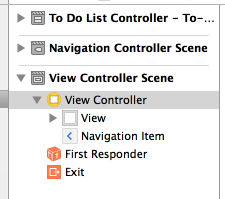
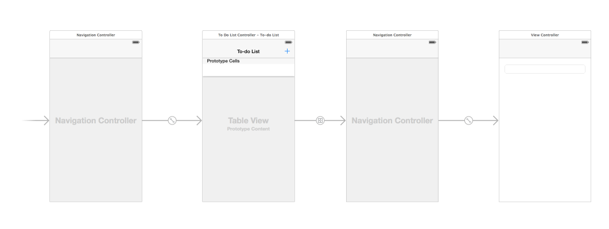
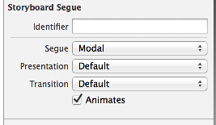
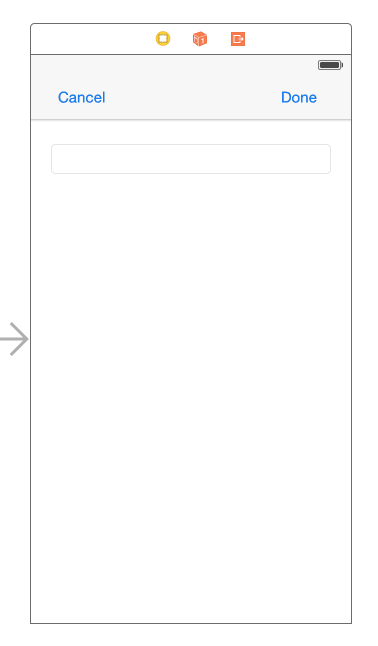

#Done / Cancel Buttons

Just as we encapsulated the TableView controller in a Navigation Controller earlier - we will now also embed the View controller.

First select the View Controller:

.. and then select "Editor->Embed in->Navigation Controller". This will reconfigure the scenes:

Run the app now - and you will see this error in the console:

~~~
2014-06-22 06:25:24.663 ToDoListSwift[33780:955905] *** Terminating app due to uncaught exception 'NSInvalidArgumentException',
reason: 'Pushing a navigation controller is not supported'
~~~

This is because of an incorrect 'seague' form the table to the item controller. Select this segue:

and reset its Segue type to 'modal':

Run the application again. This time it operates correctly, however when we navigate to the item view, we can no longer return to the table view. We will customise this now.

First, drag drop two buttons to the navigation bar of the item view:

We need to connect these buttons somehow to the TableViewController, so that when they are pressed, we can recover the todo text (or otherwise if Cancel is pressed).

Try to Control-Drag the Cancel button to the "Exit" 

This will not work, as the "Exit" responder fails to propose any outlets/endpoints. To fix this, introduce the following function into ToDoListController:

~~~
  @IBAction func unwindToList (segue: UIStoryboardSegue?)
  {
    println ("seague unwound")
  }
~~~

Try the Control-Drag of one of the buttons again - it still will not engage. One last change should fix this. Introduce the following header into the project:

##ToDoListController.h

~~~
#import <Foundation/Foundation.h>

#import <UIKit/UIKit.h>

class ToDoListController
@interface ToDoListController

- (IBAction)unwindToList: (UIStoryboardSegue *)segue;

@end
~~~

This is an Objective-C bridging header for the class ToDoListController. We need to complete the bridge in the ToDoListController swift class:

~~~
@objc(ToDoListController)
class ToDoListController: UITableViewController
{
  ...
~~~

Make sure you rebuild the app now. The, Control-Drag the buttons to the Exit - and the seague method defined above should appear. Select it for both buttons in turn.

Run the app again. Does it item view return this time? Perhaps not. If the return fails, try the following workaround:

~~~
//@objc(ToDoListController)
class ToDoListController: UITableViewController
{
  ...
~~~

(Comment out the objc attribute above).

It should work now (hopefully). I.e. 'Done' and 'Cancel' should return to the list view, and the log message should appear in the console.

