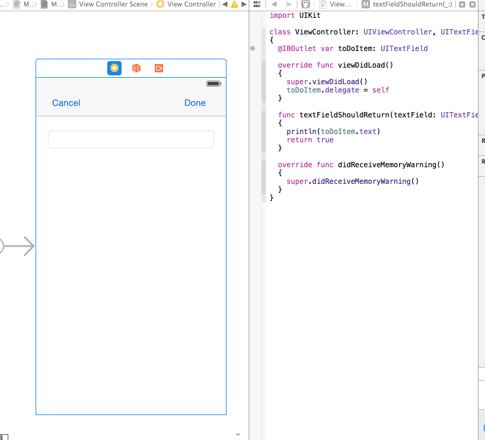

#ToDoItem Class

Introduce the following class:

##ToDoItem

~~~
class ToDoItem
{
  var completed = false
  var itemName  = ""
  
  init(completed: Bool = false, itemName:String = "empty")
  {
    self.completed = completed
    self.itemName  = itemName
  }
}
~~~

Open the View Controller again on storyboard, and using 'View->Show Assistant Editor', open the source alongside it:

Control Drag each of the buttons into the class, giving the outlet the names 'cancel' and 'done'. We should get the following generated in the ViewController:

~~~
  @IBOutlet var cancel   : UIButton
  @IBOutlet var done     : UIButton
~~~

(Make sure the type is UIButton, not UIBarButton in the generated code). We can now introduce a property to hold the todo text:

~~~
  var todo               : ToDoItem?
~~~

And we can intercept the return from the view in the 'prepareForSeague' override to initialise (and print) this text item

~~~
  override func prepareForSegue(segue: UIStoryboardSegue!, sender: AnyObject!)
  {
    if let button = sender as? NSObject
    {
      todo = button == done ? ToDoItem(itemName:toDoItem.text): nil
      println(todo?.itemName)
    }
  }
~~~

Look carefully at what we are doing here: determining which button has been pressed, and if it is done, we recover the text from the control.

Run the app now. You should see the todo item printed when 'done' is pressed.

This is the final version of the ViewController class (we have removed one of the method we had earlier):

~~~
import UIKit

class ViewController: UIViewController, UITextFieldDelegate
{
  @IBOutlet var toDoItem : UITextField
  @IBOutlet var cancel   : UIButton
  @IBOutlet var done     : UIButton
  var todo               : ToDoItem?
  
  override func viewDidLoad()
  {
    super.viewDidLoad()
  }
  
  override func prepareForSegue(segue: UIStoryboardSegue!, sender: AnyObject!)
  {
    if let button = sender as? NSObject
    {
      todo = button == done ? ToDoItem(itemName:toDoItem.text): nil
      println(todo?.itemName)
    }
  }
  
  override func didReceiveMemoryWarning()
  {
    super.didReceiveMemoryWarning()
  }
}
~~~

