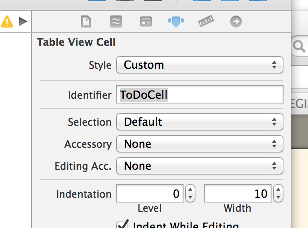

#ToDoListTableView Class

Our final step is to display the item in the TableView. 

First introduce an array of ToDoItems in the tableview controller:

~~~
  var todoItems = ToDoItem
~~~

We can refactor the unwind method to retrieve the text:

~~~
  @IBAction func unwindToList (segue: UIStoryboardSegue?)
  {
    var controller = segue?.sourceViewController as ViewController
    if controller.todo != nil
    {
      todoItems.append(controller.todo!)
      var str = controller.todo?.itemName
      println ("adding" + str! + " to list")
    }
  }
~~~

Run the app now and you should see an appropriate message in the debug console.

This method can be more elegantly written using [Optional Chaining](https://developer.apple.com/library/prerelease/mac/documentation/Swift/Conceptual/Swift_Programming_Language/OptionalChaining.html) as follows:

~~~
  @IBAction func unwindToList (segue: UIStoryboardSegue?)
  {
    if let controller = segue?.sourceViewController as? ViewController
    {
      if let toDo = controller.todo
      {
        println ("adding" + toDo.itemName + " to list")
        todoItems.append(toDo)
      }
    }
  }
~~~

Our next step is to display this list in the table. First change this method from retuning zero to returning the number of elements in the list:

~~~
  override func tableView(tableView: UITableView?, numberOfRowsInSection section: Int) -> Int
  {
    return todoItems.count
  }
~~~

Also, change the numberOfSections override to return 1:

~~~
  override func numberOfSectionsInTableView(tableView: UITableView?) -> Int
  {
    return 1
  }
~~~

In order to display the todo items, we need one further change to the storyboard. Select the "TableViewCell" in the outline view, and locate the 'ReuseIdentifier' in the Attributes Inspector:

Change this to 'ToDoCell'

We can now proceed to implement the override to display the entry for each cell:

~~~
  override func tableView(tableView: UITableView?, cellForRowAtIndexPath : NSIndexPath!) -> UITableViewCell?
  {
    let cell           = UITableViewCell(style: UITableViewCellStyle.Default, reuseIdentifier: "ToDoCell")
    var task           = todoItems[cellForRowAtIndexPath.row]
    
    cell.text          = task.itemName
    cell.accessoryType = task.completed ? UITableViewCellAccessoryType.Checkmark : UITableViewCellAccessoryType.None
    
    return cell
  }
~~~

Finally, the todoitem will not appear until we reload the data in the unwind:

~~~
  @IBAction func unwindToList (segue: UIStoryboardSegue?)
  {
    if let controller = segue?.sourceViewController as? ViewController
    {
      if let toDo = controller.todo
      {
        println ("adding" + toDo.itemName + " to list")
        todoItems.append(toDo)
        self.tableView.reloadData()
      }
    }
  }
~~~

(just one extra line here).

The app should now launch and run as expected.

This is the current version of the TableView controller:

~~~
import UIKit

//@objc(ToDoListController)
class ToDoListController: UITableViewController
{
  var todoItems = ToDoItem

  init(style: UITableViewStyle)
  {
    super.init(style: style)
  }
  
  init(coder aDecoder: NSCoder!)
  {
    super.init(coder: aDecoder)
  }
  
  override func viewDidLoad()
  {
    super.viewDidLoad()
    println ("Tableview Loaded")
   }
  
  @IBAction func unwindToList (segue: UIStoryboardSegue?)
  {
    if let controller = segue?.sourceViewController as? ViewController
    {
      if let toDo = controller.todo
      {
        println ("adding" + toDo.itemName + " to list")
        todoItems.append(toDo)
        self.tableView.reloadData()
      }
    }
  }
  
  override func didReceiveMemoryWarning()
  {
    super.didReceiveMemoryWarning()
  }

  // #pragma mark - Table view data source

  override func numberOfSectionsInTableView(tableView: UITableView?) -> Int
  {
    return 1
  }

  override func tableView(tableView: UITableView?, numberOfRowsInSection section: Int) -> Int
  {
    return todoItems.count
  }
  
  override func tableView(tableView: UITableView?, cellForRowAtIndexPath : NSIndexPath!) -> UITableViewCell?
  {
    let cell  = UITableViewCell(style: UITableViewCellStyle.Default, reuseIdentifier: "ToDoCell")
    var task           = todoItems[cellForRowAtIndexPath.row]
    
    cell.text          = task.itemName
    cell.accessoryType = task.completed ? UITableViewCellAccessoryType.Checkmark : UITableViewCellAccessoryType.None
    
    return cell
  }
}
~~~

